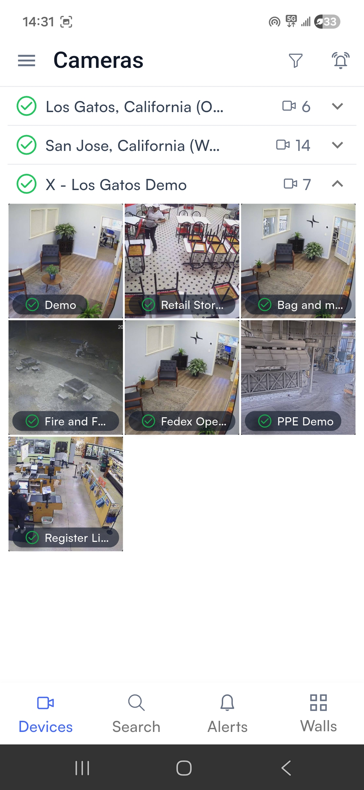
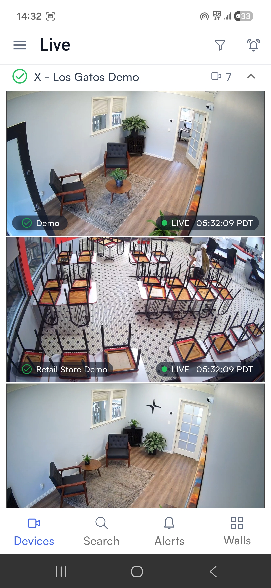
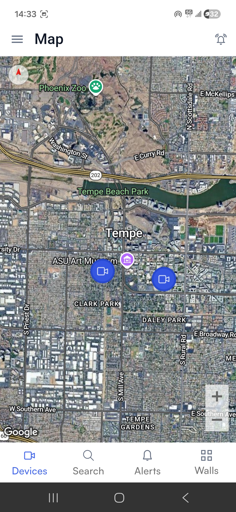
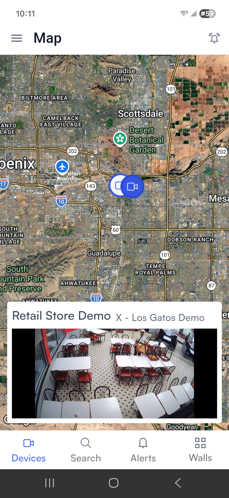
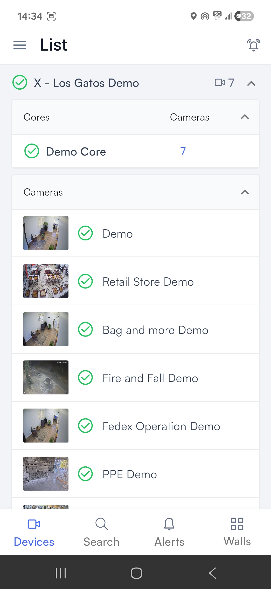

# View live feed from a single camera

## Choose the camera you want to view

The mobile app offers several ways to find the camera you want:

* [**Cameras**](view-live-feed-from-a-single-camera.md#cameras)
* [**Live**](view-live-feed-from-a-single-camera.md#live)
* [**Map**](view-live-feed-from-a-single-camera.md#map)
* [**Floor plan**](view-live-feed-from-a-single-camera.md#floor-plan)
* [**List**](view-live-feed-from-a-single-camera.md#list)

### Cameras&#x20;

The **Cameras** view is the default view when you open the app. It is also the default view when you tap **Devices** in the bottom navigation bar, unless you changed this in [Change default camera selection screen](settings/change-default-camera-selection-screen.md). You can also tap **Devices** → **Cameras** in the left navigation bar to access this view.

In this view, the cameras are grouped by location. Tap a section header to collapse or reopen it. Each camera in the section is represented by a static thumbnail image.

<figure><figcaption></figcaption></figure>

Tap a thumbnail to open [Access camera control](access-camera-control/).

### Live

The **Live** view displays each of your cameras as a tile, and automatically loads live footage from all of the tiles currently on screen. Tap **Devices** → **Live** in the left navigation bar to access this view.

<figure><figcaption></figcaption></figure>

In this view, the cameras are grouped by location. Tap a section header to collapse or reopen it.

Tap a tile to open [Access camera control](access-camera-control/).

### Map

The **Map** view shows the locations of your cameras and other devices on a satellite map powered by Google Maps. Tap **Devices** → **Map** in the left navigation bar to access this view.

<figure><figcaption></figcaption></figure>

Tap a camera icon to bring up a tile showing live footage from that camera:

<figure><figcaption></figcaption></figure>

Tap an icon to open [Access camera control](access-camera-control/).

### Floor plan

The **Floor plan** view shows your camera locations on your building's floor plans, organized by building and floor. Tap **Devices** → **Floor plan** in the left navigation bar to access this view.

<figure><figcaption></figcaption></figure>

Each green circle represents a camera. Tap a circle to bring up a tile showing live footage from the camera. Tap that tile to open [Access camera control](access-camera-control/).

### List

The **List** view shows every device in your Lumana system, including cameras and your Lumana Core(s). Tap **Devices** → **List** in the left navigation bar to access this view.

<figure><figcaption></figcaption></figure>

The list is grouped by location; a single location may contain any number of cameras and any number of Lumana Cores. Tap a section header to collapse or reopen it.

Each core lists the number of cameras connected to it. Tap the core for the list of camera names.

Each camera in the section is represented by a static thumbnail image. Tap a thumbnail to open [Access camera control](access-camera-control/).

## Change camera quality


This setting is not available for all cameras.


On the camera control page, you can change the quality of the livestream. Tap **Quality** to bring up a menu of streaming options to choose from:

<figure><figcaption></figcaption></figure>
